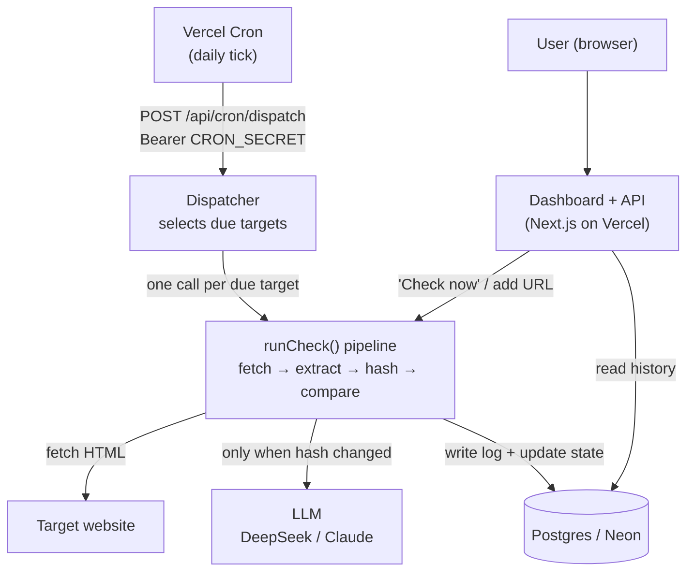
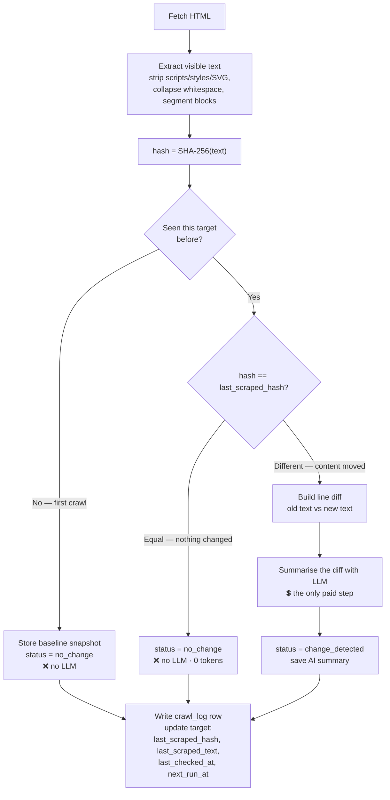
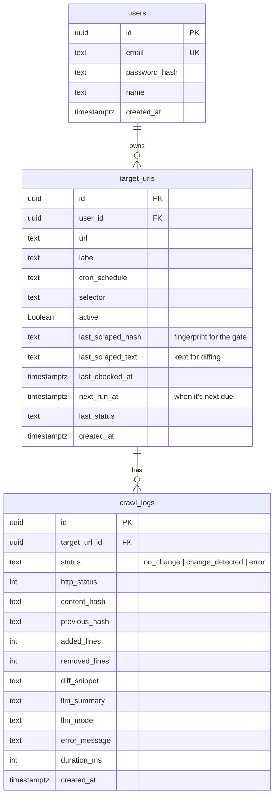

# Pecalang — page watch

Watch any URL on a schedule. When the visible text of the page changes, an LLM
writes a plain-language account of *what* changed. Built on Next.js 16 (App
Router), TypeScript, Tailwind v4, and Drizzle.

## Run locally

```bash
npm install
npm run dev
```

With no configuration it uses an embedded PGlite database and heuristic change
summaries. Sign in with the seeded demo account:

- **demo@pecalang.dev** / **watchtower** (pre-filled on the login page)

Copy `.env.example` to `.env.local` to add a real database or an LLM key.

## LLM provider

The summariser picks a provider by which key is present, in order:

1. `DEEPSEEK_API_KEY` — DeepSeek (OpenAI-compatible), model `deepseek-chat`
2. `ANTHROPIC_API_KEY` — Claude, model `claude-opus-4-8`
3. neither — a deterministic heuristic summary

## Deploying to Vercel

1. **Database.** Provision free Postgres (Neon recommended, or Supabase) and set
   `DATABASE_URL` to its **pooled** connection string. PGlite is dev-only and
   won't persist on Vercel.
2. **Env vars** in the Vercel project:
   - `DATABASE_URL` (required)
   - `SESSION_SECRET` (required — the app throws without it in production)
   - `CRON_SECRET` (required — the cron/worker routes are locked without it;
     Vercel Cron sends it automatically)
   - one of `DEEPSEEK_API_KEY` / `ANTHROPIC_API_KEY` (optional)
3. **Deploy.** `vercel.json` registers a daily cron (`0 8 * * *`) on
   `/api/cron/dispatch`, which is what the Vercel free tier supports.

### Scheduling cadence

Checks run when the cron ticks. On the current setup that's **once a day**, so
the per-URL frequency options (15 min / hourly / weekly) act as a *floor* — a
"daily" or slower URL runs on schedule, while faster ones are effectively capped
at daily. Each daily tick processes up to 8 due targets (`MAX_PER_TICK`) to stay
within the function time limit.

If you later want finer or higher-volume checking:

- **cron-job.org** (free) → `POST /api/cron/dispatch` every 15 min with header
  `Authorization: Bearer <CRON_SECRET>`.
- **Vercel Pro** → change the `vercel.json` schedule to `*/15 * * * *`.

---

# Design notes

## How it maps to the brief

| Brief step | Where it lives |
|---|---|
| Crawl each website | `lib/crawler.ts` → `fetchHtml()` (timeout, custom UA, redirects) |
| Extract the main content | `lib/crawler.ts` → `extractText()` (Cheerio; strips scripts/styles/SVG; optional CSS selector; segments text at block boundaries) |
| Detect change since previous crawl | `lib/crawler.ts` → `hashText()` (SHA-256) compared in `lib/monitor.ts` |
| Store the data efficiently | `lib/db/` (Drizzle + Postgres): `users → target_urls → crawl_logs` |
| AI summary only on meaningful change | `lib/monitor.ts` calls `lib/llm.ts` **only when the hash differs** |
| Dashboard **and** API | `app/dashboard/**` (UI) + `app/api/**` (route handlers) |

The core check is one small pipeline — **fetch → extract → hash → compare → (if changed) diff → summarise → log** — implemented as pure, testable functions in `lib/` and invoked identically from the UI ("Check now"), the API worker, and the scheduled dispatcher.

## Architecture



## The hash gate (change detection)

This is the heart of the cost model. Every check reduces the page to its
**visible text**, fingerprints it, and only pays for the LLM when that
fingerprint moves.



Because the fingerprint is taken over *normalized visible text* (not raw HTML),
invisible churn — rotating script nonces, whitespace, re-minified assets —
doesn't move the hash, so it doesn't trigger a paid summary.

## Data model



- **`target_urls`** holds current state per URL: the schedule (`cron_schedule` +
  `next_run_at`), and the two fields the gate needs — `last_scraped_hash` (the
  fingerprint it compares against) and `last_scraped_text` (used only to build
  the diff when the hash moves).
- **`crawl_logs`** is the append-only history: one row per check, carrying the
  outcome, the diff stats, and the AI summary. Indexed by `target_url_id`.

## Why this architecture

- **One full-stack Next.js app, not a split frontend/backend.** The dataset is small and the work is I/O-bound, so a single App-Router deploy (UI + route handlers together) keeps everything in one repo, one deploy, one language. Less operational surface for a tool this size.
- **Relational store (Postgres + Drizzle).** The domain is naturally relational (a user owns URLs; a URL owns an ordered history of checks). Drizzle gives typed queries and a schema that doubles as documentation. Indexes on `user_id` and `target_url_id` cover every access path.
- **Change detection is a pure function of the page text.** Extract visible text → hash it. Deterministic, cheap, and easy to reason about. The hash is the cheap gate that protects the expensive step (the LLM).
- **Dispatcher / worker split.** A scheduler-facing `/api/cron/dispatch` decides *what is due*; the check pipeline does the work. This seam is deliberate — it's where horizontal scale plugs in later (see below).
- **Provider-agnostic AI.** `lib/llm.ts` picks DeepSeek → Anthropic → a deterministic heuristic based on which key is present. No hard dependency on one vendor, and the app still produces a useful log with no key at all.
- **Zero-config dev.** With no `DATABASE_URL`, it runs on embedded PGlite so the repo works on a clean checkout; production swaps in real Postgres via one env var.

## How AI costs are reduced

1. **The hash gate is the whole trick.** The LLM is called **only when the content hash actually changes**. A page that didn't change costs *zero* tokens — most checks are free.
2. **The model sees the diff, not the page.** On a change, only the added/removed lines are sent (`buildDiff`), so input is a few hundred tokens instead of a full document.
3. **Low effort, small ceiling.** The summariser runs at `effort: "low"` with a small `max_tokens` — it's a short, well-scoped task that doesn't need more.
4. **Baseline captures are free.** The first crawl of a URL just stores a snapshot; no summary is generated.
5. **Graceful, free fallback.** If no key is set or a call fails, a deterministic heuristic writes the log entry — the pipeline never blocks on (or pays for) the LLM.

## How unnecessary crawling is avoided

- **Per-URL schedule.** Each target carries a cron expression and a computed `next_run_at`. The dispatcher's query selects **only targets that are actually due** (`active AND (next_run_at IS NULL OR next_run_at <= now)`), so nothing is fetched before its time.
- **Paused targets are skipped** entirely.
- **The hash short-circuits the costly work.** Even when a crawl does happen, an unchanged hash means no diff and no LLM call — the check ends in milliseconds.
- **Next step (documented under improvements):** send `If-None-Match` / `If-Modified-Since` and honour `304 Not Modified` to skip the *download itself*, not just the summary.

## Scaling to thousands of websites

The current build is tuned for a free-tier demo (a daily cron that runs checks inline, capped at `MAX_PER_TICK = 8`). The architecture is built so scaling is a swap at one seam, not a rewrite:

- **Stateless functions scale horizontally.** Nothing is held in process; the DB is the only shared state, reached through a **pooled** connection (Neon pooler) with `prepare: false` and one connection per instance — the serverless-safe configuration.
- **Turn the dispatcher into a producer.** Instead of running checks inline, the dispatcher enqueues **one job per due URL** onto a queue; a pool of workers consumes them. That gives per-URL retries, backpressure, and effectively unbounded throughput. (This was prototyped with trigger.dev — see the git history — then removed to keep the demo to a single free platform.)
- **Shard by schedule.** `next_run_at` is already an indexed time cursor; workers can claim due rows in bounded batches, so the fan-out is naturally partitionable.
- **Bound storage growth.** Detection needs only the hash; the stored last-text (for diffing) is one row per target and could be compressed or offloaded to object storage, and `crawl_logs` needs a retention sweep (keep last *N* per target / older-than-*X* days).
- **Politeness at scale.** Per-host rate limiting and concurrency caps so a big watchlist doesn't hammer any single origin.

## What I'd improve with another week

- **Notifications** — email / Slack / webhook on a detected change. Right now it's a change *log*; alerting is the missing half of "reports meaningful changes."
- **Queue-based worker fan-out** for real horizontal scale (above).
- **Conditional requests** (ETag / Last-Modified) and content-type awareness (JSON/feeds diffed structurally, not as text).
- **Real auth / multi-tenancy** (today it's a single seeded demo account) and login rate-limiting.
- **Drizzle migrations + log retention** instead of runtime `CREATE TABLE IF NOT EXISTS`.
- **Smarter diffing** — section/semantic-level rather than line-level, with per-target noise filters (ignore timestamps, counters, CSRF tokens) so dynamic pages don't cause false positives.
- **Tests** — the `lib/` pipeline is pure and would be quick to cover well.

## Final: approaching a 100k-line codebase I've never seen

I don't start by reading files top-to-bottom — I build a map, then follow real behaviour through it.

1. **Run it first.** Get it building and running locally (or watch it run). Nothing orients you faster than seeing the actual inputs and outputs, and the setup steps reveal the real dependencies (DB, queues, external services).
2. **Find the edges.** Locate entry points and boundaries: `main`/route definitions, the API surface, the data model/schema, config and env, and the CI/deploy pipeline. The schema and the list of endpoints tell you what the system is *about* faster than any single module.
3. **Follow one real request end-to-end.** Pick a single important flow and trace it through every layer — HTTP → handler → service → data → response. One vertical slice teaches the conventions (how they layer, name, handle errors, test) that the other 99% reuse.
4. **Read the tests.** Tests are executable documentation of intended behaviour and edge cases, and they point at the parts the authors considered load-bearing.
5. **Mine the history.** `git log`/blame on the core files, plus the PR/issue trail, explains *why* things are the way they are — the decisions and dead-ends you'd otherwise repeat.
6. **Use tooling, not willpower.** Grep/ripgrep and an LSP (go-to-definition, find-references, call hierarchy) to move by relationships; generate a dependency/module graph to see the shape.
7. **Write down the map as I go** — a short architecture note and a diagram of the main flows. If I can explain it back simply, I understand it; the note also becomes onboarding for the next person.
8. **Talk to people.** A 15-minute "walk me through the parts you'd be nervous to change" with whoever knows the code saves days, and surfaces the landmines and tribal knowledge no file states.
9. **Validate with a tiny, safe change.** A small, well-tested fix or a log line proves my mental model against reality before I touch anything that matters.

Only then do I start writing real code — with a map, a traced-through example, and a validated understanding of the conventions I'm expected to follow.
